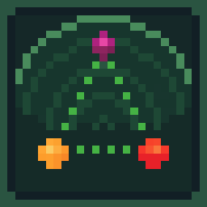
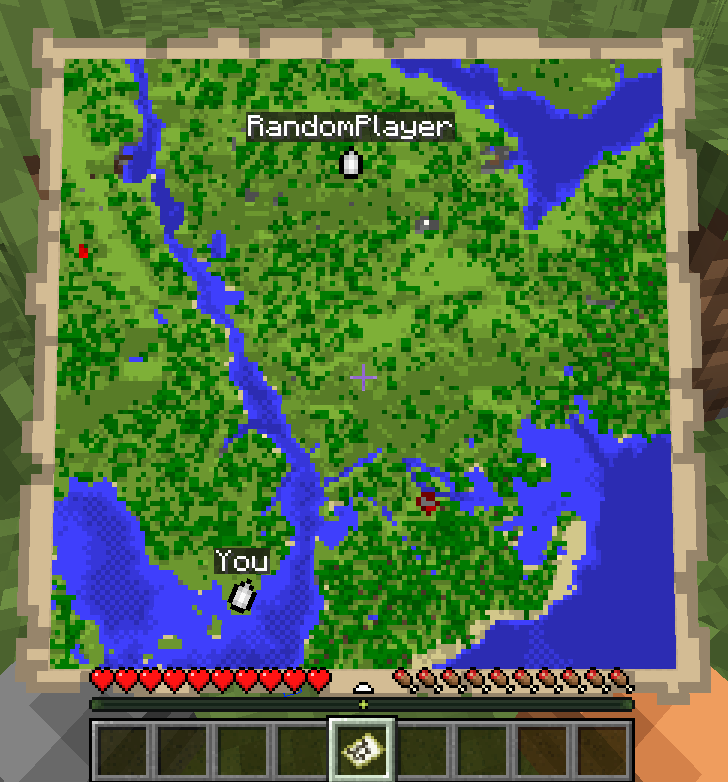
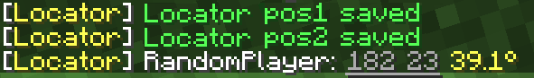
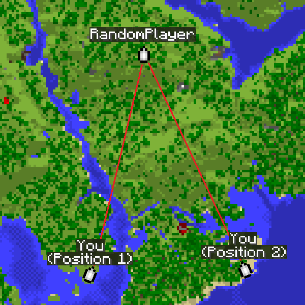
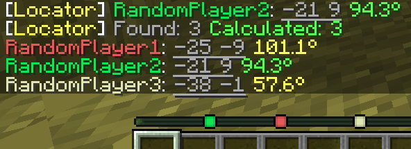

# Locator Triangulation

<!--
<a target="_blank" href="https://github.com/EgorKhabarov/LocatorTriangulation">
    
</a>&nbsp;
<a target="_blank" href="https://github.com/EgorKhabarov/LocatorTriangulation/actions/workflows/build.yml">
  
</a>


-->

[](https://github.com/EgorKhabarov/LocatorTriangulation/actions/workflows/build.yml)


A client-side Fabric mod that allows determining players' coordinates using triangulation.

The mod calculates coordinates using publicly available data accessible to regular vanilla players and acts solely as a calculator.
If the vanilla locator is disabled on the server or a player has hidden from it, the mod will not be able to determine their coordinates.
Essentially, all calculations performed by the mod can be done manually with a calculator and the vanilla client.




### Quick start

<i>The map is for example purposes only.</i>


- Run `/locator_pos1` - the mod will remember the locator's state, your current position and your view yaw.
- Move away as far as possible so the angle to the target becomes as large as possible, then run `/locator_pos2`.
- Run:
  - `/locator_locate <name>` - attempt to compute the coordinates of player `<name>`, or
  - `/locator_locate_all` - attempt to compute coordinates of all known targets.

```
/locator_pos1
/locator_pos2
/locator_locate RandomPlayer
```





The larger the angle between directions from the two points, the more accurate the coordinates.

For regular triangulation use the same commands but with the `triangulation` prefix.

### Command description

#### Locator commands

- `/locator_data` - print current locator state
- `/locator_pos1` - save the first position (locator state and your coordinates)
- `/locator_pos2` - save the second position (locator state and your coordinates)
- `/locator_get_poses` - print the saved positions
- `/locator_clear_pos1` - clear the first position
- `/locator_clear_pos2` - clear the second position
- `/locator_clear_poses` - clear both positions
- `/locator_locate <name>` - compute coordinates of player `<name>` (if both positions are saved)
- `/locator_locate_all` - compute coordinates for all known targets (if both positions are saved)

#### Regular triangulation commands

- `/triangulation_pos1` - save the first position (your coordinates + yaw)
- `/triangulation_pos2` - save the second position (your coordinates + yaw)
- `/triangulation_get_poses` - print the saved positions
- `/triangulation_clear_pos1` - clear the first position
- `/triangulation_clear_pos2` - clear the second position
- `/triangulation_clear_poses` - clear both positions
- `/triangulation_locate` — compute the intersection coordinates of the view directions (if both positions are saved)

### Accuracy notes

Triangulation accuracy strongly depends on the angle between view directions from the two positions.
Good results are achieved with an angle between directions from 20° to 150°.
Near-perfect accuracy occurs at about 70-100°.
If the angle is too small (less than 20°) or too large (150° and above), accuracy drops significantly.

For maximum accuracy, take positions so that the target is roughly at a right angle relative to you.

The corner color in the message indicates the calculation quality.
Green means near-perfect accuracy, yellow is acceptable but may include a small error, and red indicates poor accuracy.



### How to hide from the locator

There are several ways to hide from the radar: sneaking (Shift), a mob's or another player's head, a carved pumpkin, or an invisibility potion.
